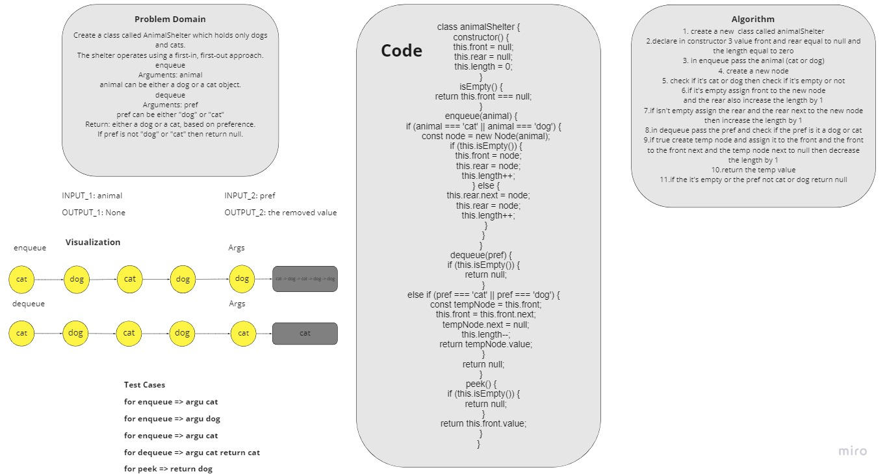

# Challenge Summary

<!-- Description of the challenge -->

Create a class called AnimalShelter which holds only dogs and cats.
The shelter operates using a first-in, first-out approach.

1. enqueue

   - Arguments: animal
     > animal can be either a dog or a cat object.

2. dequeue

   - Arguments: pref

     > pref can be either "dog" or "cat", Return: either a dog or a cat, based on preference. If pref is not "dog" or "cat" then return null.

## Write tests to prove the following functionality:

✓ Can successfully enqueue a cat.

✓ Can successfully enqueue a dog.

✓ Can successfully enqueue a cat and a dog.

✓ Can successfully dequeue a cat or a dog.

✓ Can return null if no animal is in the shelter.

✓ Can successfully dequeue a cat and a dog.

## Whiteboard Process

<!-- Embedded whiteboard image -->

## Approach & Efficiency

<!-- What approach did you take? Why? What is the Big O space/time for this approach? -->

I used the `Node` approach but we can use `Array`

The big O => `O(1)` time.

The big O => `O(n)` space.

## Solution

<!-- Show how to run your code, and examples of it in action -->

I used queue to apply first-in first-out approach and an condition for the enqueue to be cat or dog and for the dequeue to be cat or dog and return the value.
