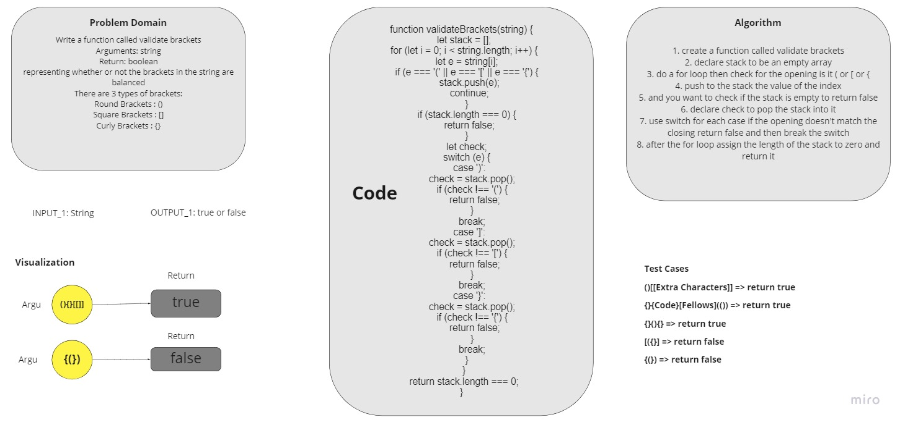

# Challenge Summary

<!-- Description of the challenge -->

Write a function called validate brackets

- Arguments: string

- Return: boolean

> representing whether or not the brackets in the string are balanced

## Write tests to prove the following functionality:

✓ should return true for valid brackets.

✓ should return false for invalid brackets.

## Whiteboard Process

<!-- Embedded whiteboard image -->



## Approach & Efficiency

<!-- What approach did you take? Why? What is the Big O space/time for this approach? -->

I used the Array approach like first in last out

The big O => `O(1)` time.

The big O => `O(n)` space.

## Solution

<!-- Show how to run your code, and examples of it in action -->

you can send all kind of brackets and the function will check if the brackets balanced or not if balanced will return true if not will retrun false.

Examples:

```js
let string = "{}"; // true
let string2 = "{}(){}"; // true
let string3 = "()[[Extra Characters]]"; // true
let string4 = "(){}[[]]"; // true
let string5 = "{}{Code}[Fellows](())"; // true
let string6 = "[({}]"; // false
let string7 = "(]("; // false
let string8 = "{(})"; // false
```
