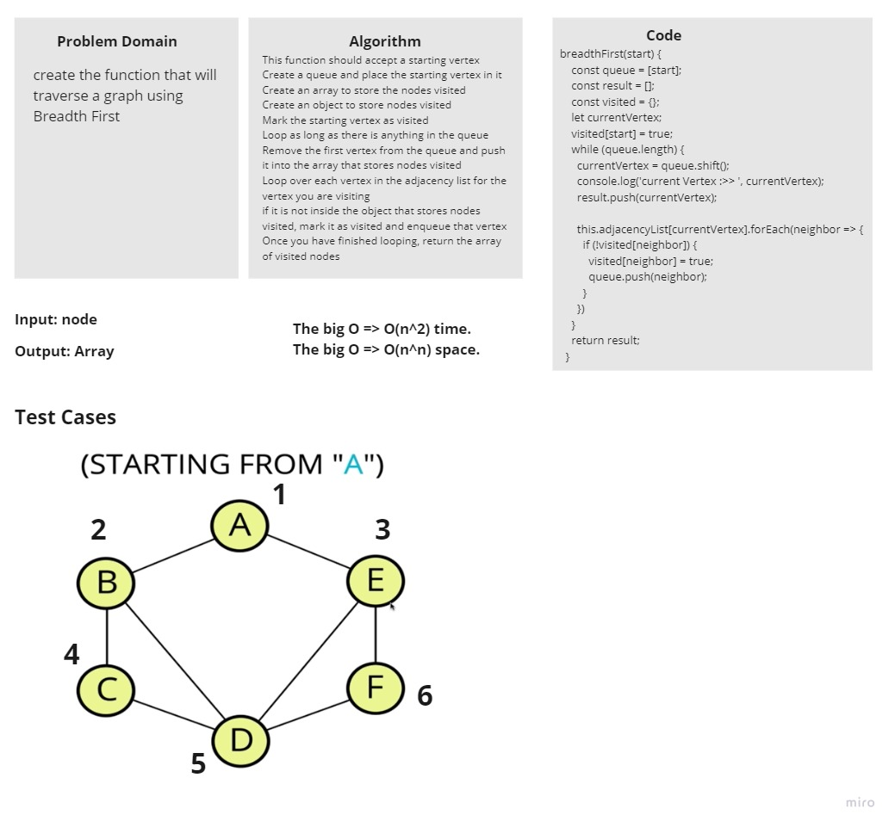

# Graph

<!-- Short summary or background information -->

A graph consists of a set of nodes, or vertices, connected by edges. An edge consists of a pair of vertices. For example, if we establish a pair between two vertices, A and B, we refer t0 this related pairing as an edge. Because they are connected by an edge, A and B are adjacent.

We can use the graph data structure in conjunction with an optimization algorithm for determining an optimal path, such as GPS.

We can use the graph data structure when modeling network topology, such as the internet or your friends on Facebook!.

Breadth-First Search, we search all of the edges connected to a vertex before moving on to search the edges of the connected vertices.

## Challenge

create the method that will traverse a graph using Breadth First

<!-- Description of the challenge -->

## Write tests to prove the following functionality:

✓ should traverse the graph

## whiteboard

## Approach & Efficiency

<!-- What approach did you take? Why? What is the Big O space/time for this approach? -->

I used `Graph` with `Object` approach

For the `breadthFirst`:

The big O => `O(n^2)` time.

The big O => `O(n^2)` space.

## API

<!-- Description of each method publicly available in each of your hashtable -->

- addVertex
  - Arguments: vertex
  - Returns: nothing
  - This method should add a vertex to the vertex list and return nothing
- addEdge
  - Arguments: vertex1, vertex2
  - Returns: nothing
  - This method should add a edge to the vertex list and return nothing
- breadth-first
  - Arguments: starting vertex
  - Returns: array of vertices
  - This method should traverse the vertex list and return array of vertices that were found in the vertex list
