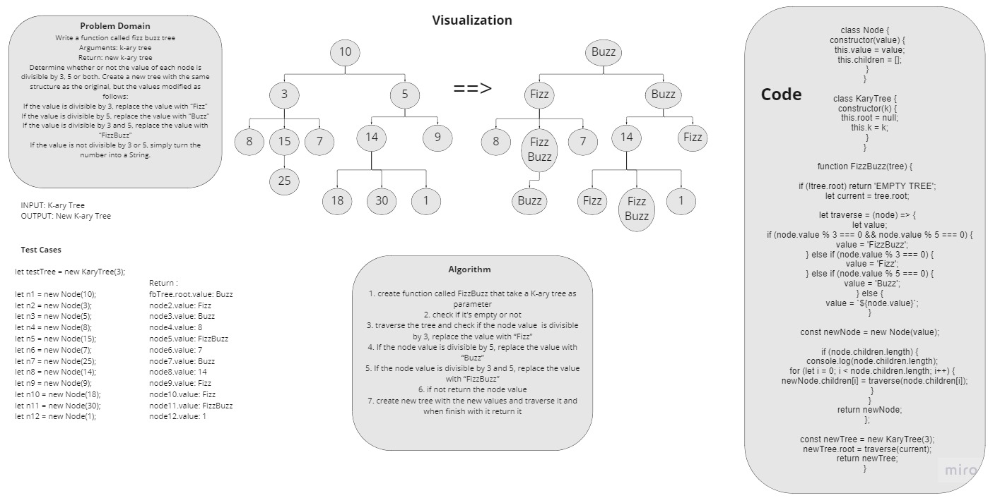

# Challenge Summary

<!-- Description of the challenge -->

Write a function called `fizz buzz tree`

- Arguments: k-ary tree
- Return: new k-ary tree

Determine whether or not the value of each node is divisible by 3, 5 or both. Create a new tree with the same structure as the original, but the values modified as follows:

- If the value is divisible by 3, replace the value with “Fizz”
- If the value is divisible by 5, replace the value with “Buzz”
- If the value is divisible by 3 and 5, replace the value with “FizzBuzz”
- If the value is not divisible by 3 or 5, simply turn the number into a String.

## Write tests to prove the following functionality:

✓ should return an exception on an empty tree.

✓ should return fizz buzz, fizzbuzz, or number tree as expected.

## Whiteboard Process

<!-- Embedded whiteboard image -->

## Approach & Efficiency

<!-- What approach did you take? Why? What is the Big O space/time for this approach? -->

I used Node approach

The `Big O` for time is `O(n)`

The `Big O` for space is `O(2n)`

## Solution

<!-- Show how to run your code, and examples of it in action -->

run the code by `node index.js`

The input will be a `K-ary Tree`

It will return New `K-ary Tree`
