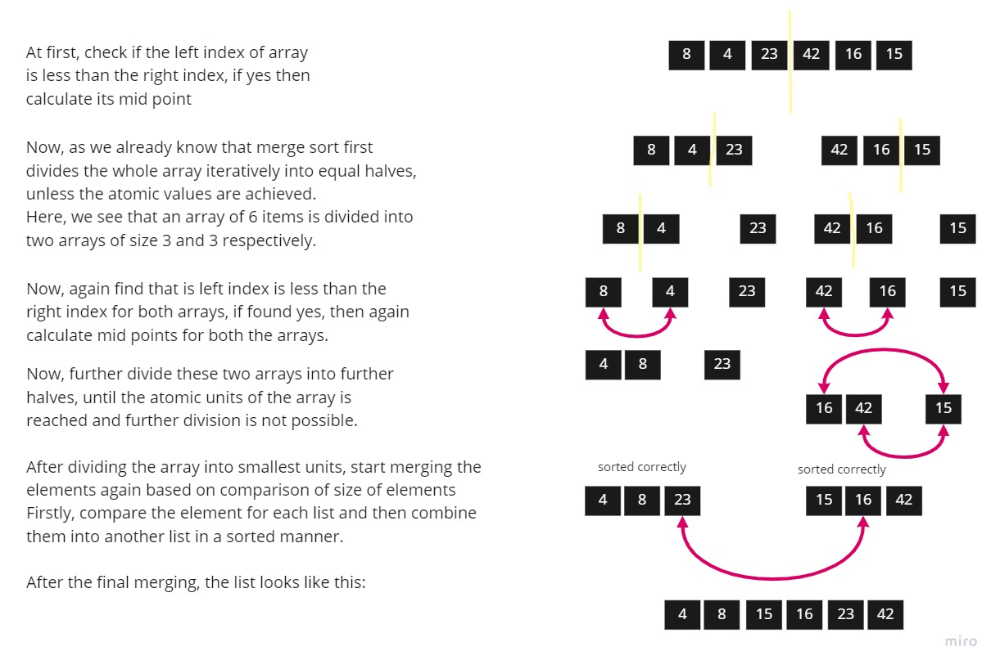

# Challenge Summary

<!-- Description of the challenge -->

## Merge Sort

The Merge Sort algorithm is a sorting algorithm that is considered an example of the divide and conquer strategy. So, in this algorithm, the array is initially divided into two equal halves and then they are combined in a sorted manner. We can think of it as a recursive algorithm that continuously splits the array in half until it cannot be further divided. This means that if the array becomes empty or has only one element left, the dividing will stop, i.e. it is the base case to stop the recursion. If the array has multiple elements, we split the array into halves and recursively invoke the merge sort on each of the halves. Finally, when both the halves are sorted, the merge operation is applied. Merge operation is the process of taking two smaller sorted arrays and combining them to eventually make a larger one.

## Code

```js
function mergeSort(arr) {
  if (arr.length < 2) {
    return arr;
  }
  const middle = Math.floor(arr.length / 2);
  const left = arr.slice(0, middle);
  const right = arr.slice(middle);
  return merge(mergeSort(left), mergeSort(right));
}

function merge(left, right) {
  const result = [];
  while (left.length && right.length) {
    if (left[0] <= right[0]) {
      result.push(left.shift());
    } else {
      result.push(right.shift());
    }
  }
  return result.concat(left).concat(right);
}
```

## Write tests to prove the following functionality:

✓ should sort Sample Array.

✓ should sort Reverse-sorted.

✓ should sort Few uniques.

✓ should sort Nearly-sorted.

## Whiteboard Process

<!-- Embedded whiteboard image -->

### Trace



## Approach & Efficiency

<!-- What approach did you take? Why? What is the Big O space/time for this approach? -->

I used the Array approach with `while` loop

The big O => `O(n log(n))` time.

The big O => `O(n)` space.

## Solution

<!-- Show how to run your code, and examples of it in action -->

• Declare left variable to 0 and right variable to n-1

• Find mid by medium formula. mid = (left+right)/2

• Call merge sort on (left,mid)

• Call merge sort on (mid+1,rear)

• Continue till left is less than right

• Then call merge function to perform merge sort.

Examples:

```js
let arr1 = [8, 4, 23, 42, 16, 15]; // [ 4, 8, 15, 16, 23, 42 ]
let arr2 = [20, 18, 12, 8, 5, -2]; // [ -2, 5, 8, 12, 18, 20 ]
let arr3 = [5, 12, 7, 5, 5, 7]; // [ 5, 5, 5, 7, 7, 12 ]
let arr4 = [2, 3, 5, 7, 13, 11]; // [ 2, 3, 5, 7, 11, 13 ]
```
