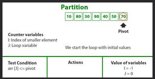
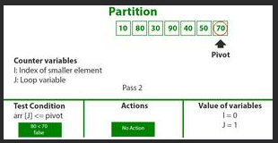
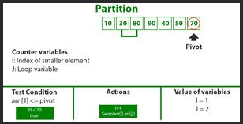
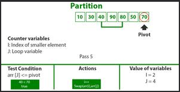
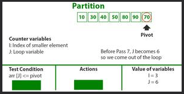
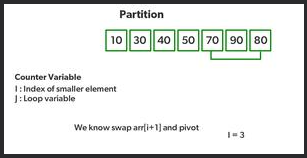
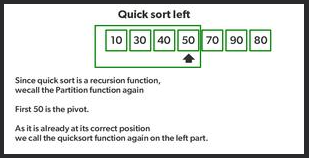
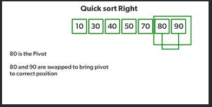

# Challenge Summary

<!-- Description of the challenge -->

## Quick Sort

Quick Sort is a Divide and Conquer algorithm. It picks an element as a pivot and partitions the given array around the picked pivot. There are many different versions of quickSort that pick pivot in different ways.

- Always pick the first element as a pivot.

- Always pick the last element as a pivot.

- Pick a random element as a pivot.

- Pick median as the pivot.

## Code

```js
function swap(arr, i, j) {
  let temp = arr[i];
  arr[i] = arr[j];
  arr[j] = temp;
}

function partition(arr, low, high) {
  let pivot = arr[high];
  let i = low - 1;
  for (let j = low; j <= high - 1; j++) {
    if (arr[j] < pivot) {
      i++;
      swap(arr, i, j);
    }
  }
  swap(arr, i + 1, high);
  return i + 1;
}

function quickSort(arr, low, high) {
  if (low < high) {
    let pi = partition(arr, low, high);
    quickSort(arr, low, pi - 1);
    quickSort(arr, pi + 1, high);
  }
}
```

## Write tests to prove the following functionality:

✓ Sample arrays.

✓ Reverse-sorted.

✓ Few uniques.

✓ Nearly-sorted.

## Whiteboard Process

<!-- Embedded whiteboard image -->

### Trace

Consider: arr[] = {10, 80, 30, 90, 40, 50, 70}

- Indexes: 0 1 2 3 4 5 6
- low = 0, high = 6, pivot = arr[h] = 70
- Initialize index of smaller element, i = -1

  

- Traverse elements from j = low to high-1
  - j = 0: Since arr[j] <= pivot, do i++ and swap(arr[i], arr[j])
  - i = 0
- arr[] = {10, 80, 30, 90, 40, 50, 70} // No change as i and j are same
- j = 1: Since arr[j] > pivot, do nothing

  

- j = 2 : Since arr[j] <= pivot, do i++ and swap(arr[i], arr[j])
- i = 1
- arr[] = {10, 30, 80, 90, 40, 50, 70} // We swap 80 and 30

  

- j = 3 : Since arr[j] > pivot, do nothing // No change in i and arr[]
- j = 4 : Since arr[j] <= pivot, do i++ and swap(arr[i], arr[j])
- i = 2
- arr[] = {10, 30, 40, 90, 80, 50, 70} // 80 and 40 Swapped

  

- j = 5 : Since arr[j] <= pivot, do i++ and swap arr[i] with arr[j]
- i = 3
- arr[] = {10, 30, 40, 50, 80, 90, 70} // 90 and 50 Swapped

  

- We come out of loop because j is now equal to high-1.
- Finally we place pivot at correct position by swapping arr[i+1] and arr[high] (or pivot)
- arr[] = {10, 30, 40, 50, 70, 90, 80} // 80 and 70 Swapped

  

- Now 70 is at its correct place. All elements smaller than 70 are before it and all elements greater than 70 are after it.
- Since quick sort is a recursive function, we call the partition function again at left and right partitions

  

- Again call function at right part and swap 80 and 90

  

## Approach & Efficiency

<!-- What approach did you take? Why? What is the Big O space/time for this approach? -->

I used the Array approach with two `for` loops

The big O => `O(nLogn)` time.

The big O => `O(n)` space.

## Solution

<!-- Show how to run your code, and examples of it in action -->

The key process in quickSort is a partition(). The target of partitions is, given an array and an element x of an array as the pivot, put x at its correct position in a sorted array and put all smaller elements (smaller than x) before x, and put all greater elements (greater than x) after x. All this should be done in linear time.

Examples:

```js
// Driver program to test above functions
let arr = [8, 4, 23, 42, 16, 15];
quickSort(arr, 0, arr.length - 1);
console.log(arr);

// Output: [4, 8, 15, 16, 23, 42]

let arr1 = [20, 18, 12, 8, 5, -2];
quickSort(arr1, 0, arr1.length - 1);
console.log(arr1);

// Output: [-2, 5, 8, 12, 18, 20]

let arr2 = [5, 12, 7, 5, 5, 7];
quickSort(arr2, 0, arr2.length - 1);
console.log(arr2);

// Output: [5, 5, 5, 7, 7, 12]

let arr3 = [2, 3, 5, 7, 13, 11];
quickSort(arr3, 0, arr3.length - 1);
console.log(arr3);

// Output: [2, 3, 5, 7, 11, 13]
```
