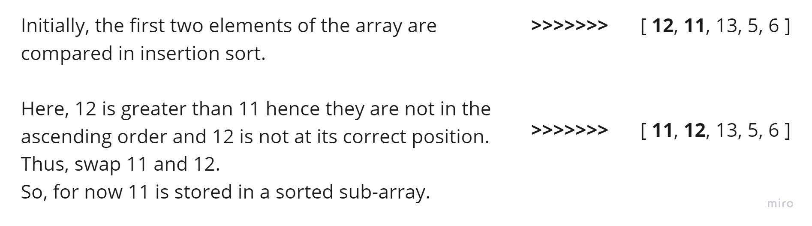

# Challenge Summary

<!-- Description of the challenge -->

## Insertion sort

Insertion sort is a simple sorting algorithm that works similar to the way you sort playing cards in your hands. The array is virtually split into a sorted and an unsorted part. Values from the unsorted part are picked and placed at the correct position in the sorted part.

## Code

```js
function insertionSort(arr) {
  for (let i = 1; i < arr.length; i++) {
    let currentValue = arr[i];
    let j;
    for (j = i - 1; j >= 0 && arr[j] > currentValue; j--) {
      arr[j + 1] = arr[j];
    }
    arr[j + 1] = currentValue;
  }
  return arr;
}
```

## Write tests to prove the following functionality:

✓ Sample arrays.

✓ Reverse-sorted.

✓ Few uniques.

✓ Nearly-sorted.

## Whiteboard Process

<!-- Embedded whiteboard image -->

### Trace

Sample Array: [12 , 11 , 13 , 5 , 6]

Pass 1


Pass 2


Pass 3


Pass 4


## Approach & Efficiency

<!-- What approach did you take? Why? What is the Big O space/time for this approach? -->

I used the Array approach with two `for` loops

The big O => `O(n^2)` time.

The big O => `O(1)` space.

## Solution

<!-- Show how to run your code, and examples of it in action -->

To sort an array of size N in ascending order:

Iterate from arr[1] to arr[N] over the array.

Compare the current element (currentValue) to its predecessor.

If the currentValue element is smaller than its predecessor, compare it to the elements before.

Move the greater elements one position up to make space for the swapped element.

Examples:

```js
let arr1 = [8, 4, 23, 42, 16, 15]; // [ 4, 8, 15, 16, 23, 42 ]
let arr2 = [20, 18, 12, 8, 5, -2]; // [ -2, 5, 8, 12, 18, 20 ]
let arr3 = [5, 12, 7, 5, 5, 7]; // [ 5, 5, 5, 7, 7, 12 ]
let arr4 = [2, 3, 5, 7, 13, 11]; // [ 2, 3, 5, 7, 11, 13 ]
```
