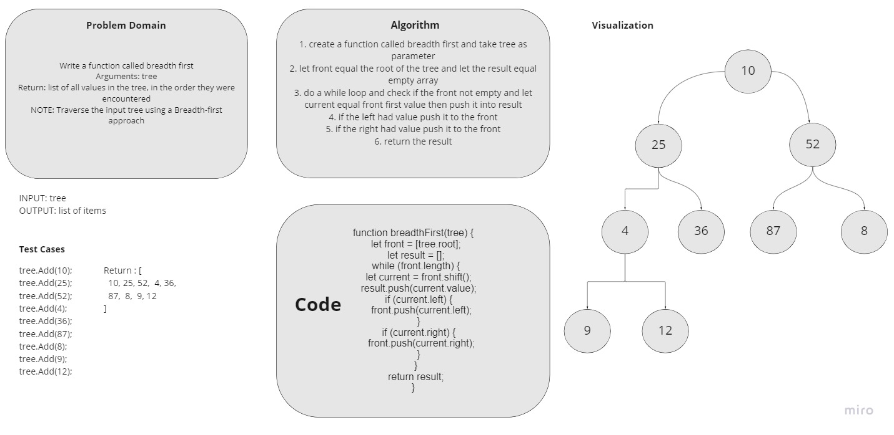

# Challenge Summary

<!-- Description of the challenge -->

Write a function called breadth first

- Arguments: tree
- Return: list of all values in the tree, in the order they were encountered

> NOTE: Traverse the input tree using a Breadth-first approach

## Write tests to prove the following functionality:

✓ Can create a binary tree.

✓ Can add a value to a binary tree.

✓ Can use breadth first to traverse a binary tree.

## Whiteboard Process

<!-- Embedded whiteboard image -->

## Approach & Efficiency

<!-- What approach did you take? Why? What is the Big O space/time for this approach? -->

I used Node approach

The `Big O` for time is `O(n)`

The `Big O` for space is `O(n)`

## Solution

<!-- Show how to run your code, and examples of it in action -->

run the code by `node index.js`

The input will be a `Binary Tree`

It will return the list of values in the levels order
