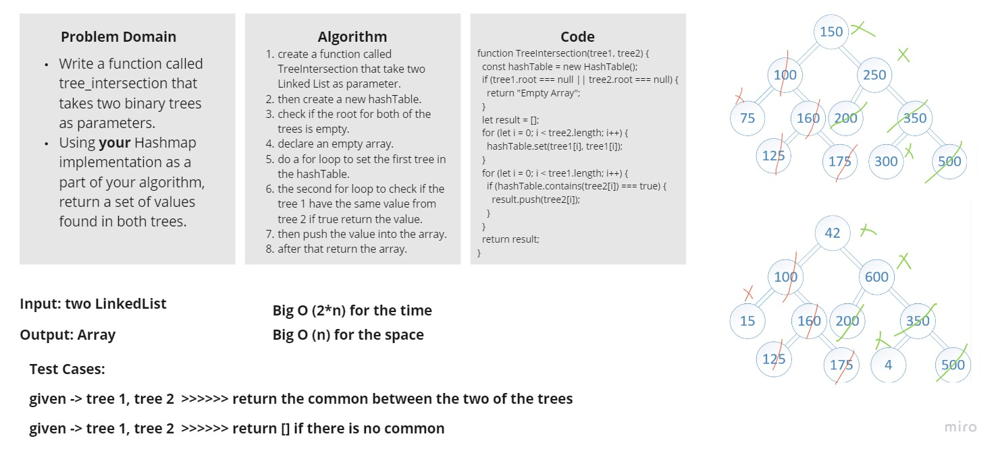

# Hashtables

<!-- Short summary or background information -->

- Hash - A hash is the result of some algorithm taking an incoming string and converting it into a value that could be used for either security or some other purpose. In the case of a hashtable, it is used to determine the index of the array.
- Buckets - A bucket is what is contained in each index of the array of the hashtable. Each index is a bucket. An index could potentially contain multiple key/value pairs if a collision occurs.
- Collisions - A collision is what happens when more than one key gets hashed to the same location of the hashtable.

## Challenge

Write a function called `TreeIntersection` that takes two binary trees as parameters.
Using your `Hashmap` implementation as a part of your algorithm, return a set of values found in both trees.

<!-- Description of the challenge -->

## Write tests to prove the following functionality:

✓ Should return a tree intersection.

✓ Should return a tree intersection.

✓ Should return a tree intersection.

## Whiteboard

## Approach & Efficiency

<!-- What approach did you take? Why? What is the Big O space/time for this approach? -->

I used `hashtable` with `linkedList` approach

`Big O (2*n)` for the `time`

`Big O (n)` for the `space`

## API

<!-- Description of each method publicly available in each of your hashtable -->

- set

  - Arguments: key, value
  - Returns: nothing
  - This method should hash the key, and set the key and value pair in the table, handling collisions as needed.
  - Should a given key already exist, replace its value from the value argument given to this method.

- contains

  - Arguments: key
  - Returns: Boolean, indicating if the key exists in the table already.

- function called `TreeIntersection` that finds the common values between the two trees.
  - Arguments: Two LinkedList
  - Return: Array of common values
